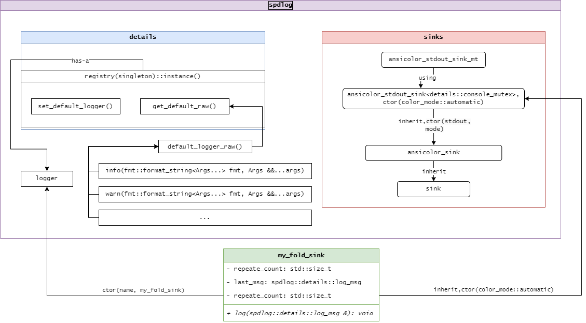

# A fold sink for logger of spdlog

In the context of logger, a sink refers to the destination of log, which the log data will be sent or write to. This tiny project is aiming to impls a simple sink to deal with the repeating log msg. While the log msg repeating, the following msg won\` be printed. Insteading, the msg likes "prev msg repeated n times" is printed.

## How to build this project

Firstly, make sure you have installed spdlog.

```bash
cmake -B ./build
cmake --build ./build
```

## Some notes during coding

### the singleton method: `spdlog::details::registry`

The singleton, `spdlog::details::registry` is responsible for managing all logger registered with `spdlog`, making them can be retrieved by name.

### `spdlog::details::make_unique<>()`

`spdlog::details::make_unique` is a utility function used internally by `spdlog` to create instances of objects in a way similar to `std::make_unique`, which was introduced in C++14.

In C++11, `std::make_unique` does not exist, so libraries like `spdlog` use their own implementations for compatibility. The purpose of `spdlog::details::make_unique` is to provide a cross-compatible mechanism for safely allocating memory for objects on the heap and returning them as std::unique_ptr.

**Purpose:**
 - *Memory Safety*: It ensures exception-safe allocation of objects by constructing them directly within the unique pointer.
 - *Compatibility*: `spdlog::details::make_unique` is typically provided to support environments where `std::make_unique` is not available (e.g., C++11).
  
 This code snippet shows how to implement `make_unique` in different C++ standard versions using conditional compilation. It chooses between using the standard library's `std::make_unique` in C++14 and above or providing a custom implementation for C++11.

#### Source Code in `spdlog`:

```cpp
#if __cplusplus >= 201402L // C++14 and beyond
using std::make_unique;
#else
template<typename T, typename... Args>
std::unique_ptr<T> make_unique(Args &&...args)
{
    static_assert(!std::is_array<T>::value, "arrays not supported");
    return std::unique_ptr<T>(new T(std::forward<Args>(args)...));
}
#endif
```

#### Key Points:

1. **Conditional Compilation**:
   ```cpp
   #if __cplusplus >= 201402L
   ```
   - `__cplusplus` is a predefined macro that indicates the version of the C++ standard the compiler is using.
   - If `__cplusplus` is greater than or equal to `201402L`, the code assumes the compiler supports C++14 or newer and directly uses the standard library's `std::make_unique`.
     - `201402L` is the version value for C++14. C++11 uses `201103L`.

2. **Custom Implementation for C++11**:
   If the compiler doesn't support C++14 (i.e., it's using C++11), the code provides a custom `make_unique` function:
   ```cpp
   template<typename T, typename... Args>
   std::unique_ptr<T> make_unique(Args &&...args)
   {
       static_assert(!std::is_array<T>::value, "arrays not supported");
       return std::unique_ptr<T>(new T(std::forward<Args>(args)...));
   }
   ```
   - **Template parameters `T` and variadic parameters `Args`**:
     - `T` is the type of the object to create.
     - `Args...` is a variadic template to accept any number and type of constructor arguments.
   - **`std::forward`**: Perfectly forwards arguments to the object's constructor, preserving value types or references to avoid unnecessary copies.
   - **`static_assert`**: Ensures at compile time that `T` is not an array type since this implementation does not support arrays.

   - **Return value**: The function creates a new object using `new`, wraps it in a `std::unique_ptr`, and returns the smart pointer.

3. **`static_assert`**:
   ```cpp
   static_assert(!std::is_array<T>::value, "arrays not supported");
   ```
   - This compile-time assertion ensures that `T` is not an array type. If you try to use this `make_unique` to allocate an array, it will trigger a compile-time error.
   - The C++14 version of `std::make_unique` supports dynamic arrays, but this custom implementation doesn't, hence the need for this assertion to prevent incorrect usage.

### what happen when invoke `spdlog::info()`


